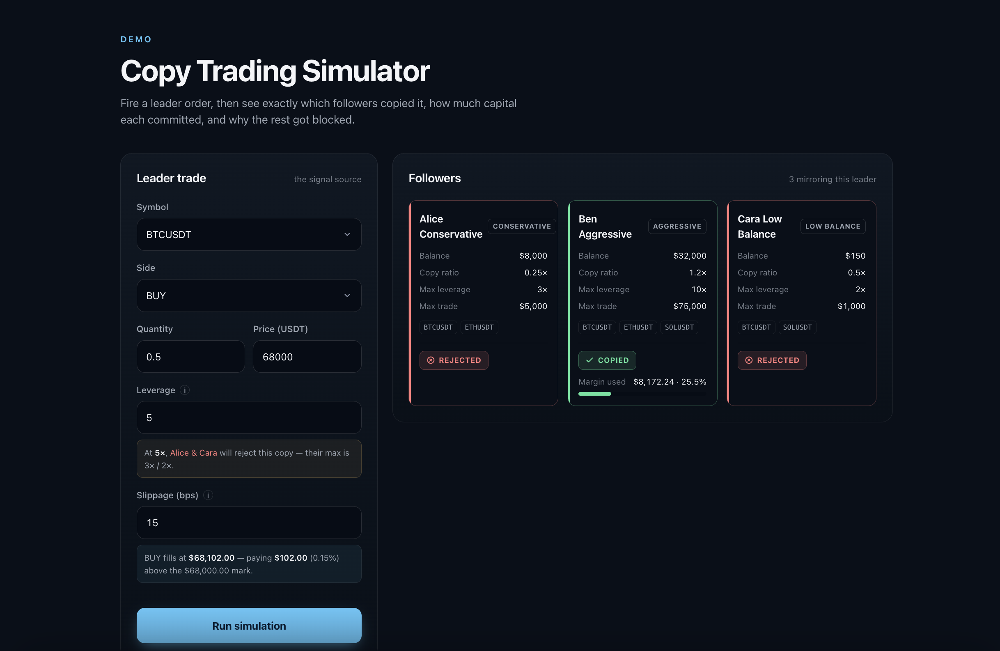
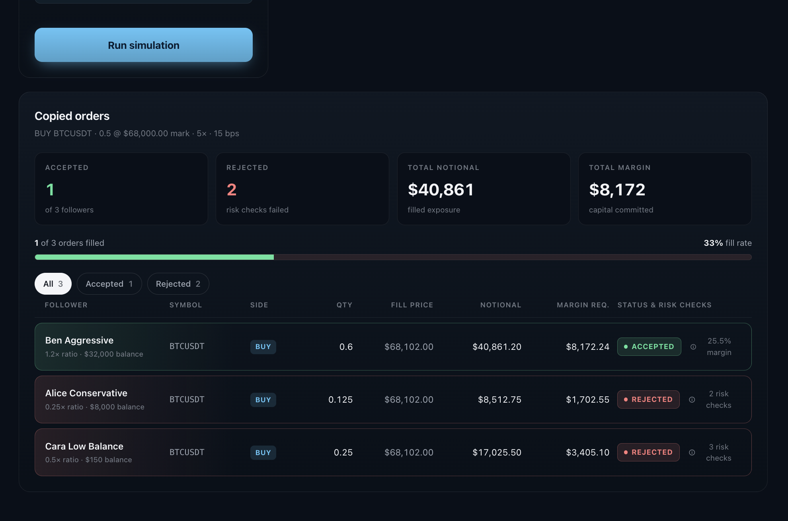

# Copy Trading Candidate Test

This repository is a focused technical test for candidates.

## Project scope

- React + TypeScript frontend
- Express + TypeScript backend
- Mock follower accounts and leader trades
- Copy trading simulation with risk checks
- Backend tests for trading logic

## Candidate instructions

Read `docs/CANDIDATE_BRIEF.md` and complete the task in **2-3 hours**.

## Screenshots




## Run locally

```bash
npm run install:all
npm run dev
```

Open:

- Frontend: http://localhost:5173
- Backend: http://localhost:4000

Run backend tests:

```bash
npm test --prefix backend
```
